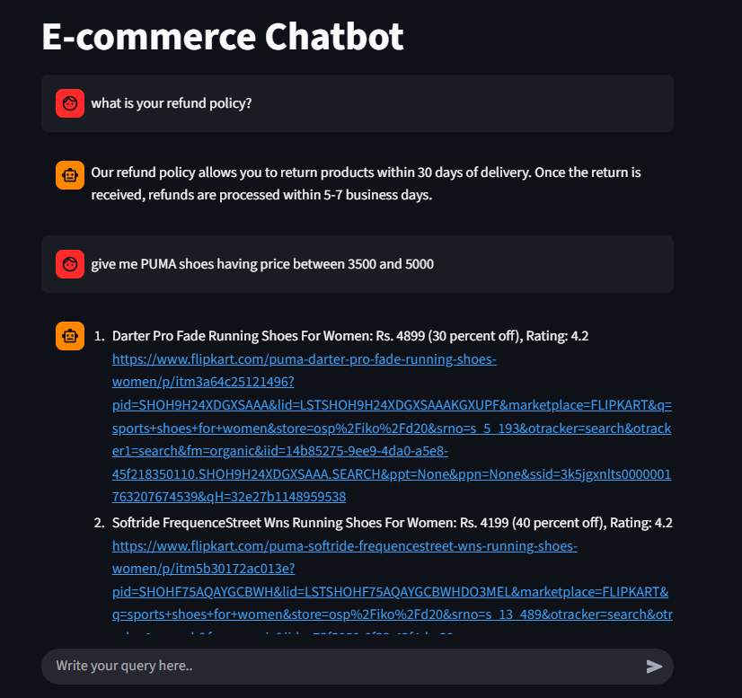

<div align="center">

# 🌟 E-Commerce Chatbot — AI-Powered Shopping Assistant  

<!-- badges -->
[](https://www.python.org/)
[](https://streamlit.io/)
[]()
[]()
[]()

</div>


## 🌐 Live Demo
🔗 [Try the E-Commerce Chatbot](app)

--- 

## 🖼️ Preview

Below is a sample view of the application interface 👇



---

A smart and powerful **AI-driven e-commerce chatbot** built with **Streamlit**, **Semantic Routing**, **Groq LLM**, **ChromaDB**, **Selenium Scraping**, and **SQLite**.

This chatbot can answer customer FAQs, understand natural language shopping queries, generate SQL using LLM, search real product data, and return beautifully formatted results.

---
## 🚀 Features

### 🧠 **Intelligent Semantic Routing**
Automatically determines whether a query is:
- a **FAQ question**
- a **Product search query**

### 🤖 **LLM-Powered SQL Generation**
- Converts natural language → SQL inside `<SQL>...</SQL>` tags  
- Executes the query on a live SQLite database

### 📦 **Real Product Data**
- 1000+ Flipkart products scraped using Selenium
- Converted to SQLite with `csv_to_sqlite.py`

### 💬 **Smart Product Answering**
Returns clean product lists like:
1. Puma Women's Running Shoes: Rs. 1499 (20% off), Rating: 4.3 <link>
2. Nike Air Zoom: Rs. 3999 (15% off), Rating: 4.5 <link>


### 📚 **FAQ Knowledge Base**
Stored in ChromaDB (vector search).  
Responds instantly with LLM-polished answers.

---
## 🏗️ Project Structure
```plaintext
e-commerce-chatbot/
│
├── app/
│   ├── main.py
│   ├── router.py
│   ├── faq.py
│   ├── sql.py
│   └── resources/
│       └── faq_data.csv
│
├── web_scrapping/
│   ├── flipkart_data_extraction.ipynb
│   ├── flipkart_product_data.csv
│   ├── csv_to_sqlite.py
│   └── products.db   ← generated database
│
├── assets/
│   └── app_preview.png   ← preview image used in README
│
├── requirements.txt
├── README.md
└── .env
```


## ⚙️ Installation

### **1. Clone the project**
```bash
git clone <your-repo-url>
cd e-commerce-chatbot
```

### **2. Create venv**
```bash
python -m venv venv
venv\Scripts\activate          # Windows
```
### **3. Install dependencies**
```bash
pip install -r requirements.txt
```
### **4. Configure API Keys**
Create .env file inside app/:
```bash
GROQ_API_KEY=your_groq_api_key
GROQ_MODEL=llama-3.3-70b-versatile
```

## 🗄️ Database Setup
Run this to generate the SQLite DB:
```bash
cd web_scrapping
python csv_to_sqlite.py
``` 
This creates:
```bash
web_scrapping/products.db
```
Make sure this file exists before starting the chatbot.

## ▶️ Run the Chatbot
From project root:
```bash
streamlit run app/main.py
```
## 🎯 Example Queries

Try these:

### 🛍️ Product Queries

- "Show me all Nike shoes"
- "Puma shoes under 3000"
- "Shoes with rating greater than 4"
- "Give me sports shoes with discount above 20%"

### ❓ FAQ Queries

- "What is your return policy?"
- "Do you provide cash on delivery?"
- "How do I contact customer support?"

## 🧱 Architecture

                ┌──────────────────────┐
                │      User Query      │
                └─────────┬────────────┘
                          ▼
             ┌──────────────────────────┐
             │    Semantic Router       │
             └───────┬─────────┬────────┘
                     │         │
          FAQ Query  │         │ Product Query
                     │         │
                     ▼         ▼
          ┌────────────────┐   ┌─────────────────────────────┐
          │  ChromaDB FAQ  │   │ LLM SQL Generator (Groq)    │
          │   Retrieval    │   │ SQLite Product Search       │
          └───────┬────────┘   └──────────────┬──────────────┘
                  │                           │
                  ▼                           ▼
           Clean Natural Answer         Formatted Product List
                  │                           │
                  |                           ▼
                  └──────────────► Final Chatbot Reply

## 🧩 Tech Stack
| Component                 | Technology Used                                             |
| ------------------------- | ----------------------------------------------------------- |
| **Frontend UI**           | Streamlit                                                   |
| **Semantic Routing**      | Semantic Router                                             |
| **Embeddings**            | **Hugging Face Sentence Transformers** (`all-MiniLM-L6-v2`) |
| **LLM for SQL & Answers** | Groq                                                        |
| **Vector Store**          | ChromaDB                                                    |
| **Database**              | SQLite                                                      |
| **Web Scraping**          | Selenium + BeautifulSoup                                    |
| **Programming Language**  | Python                                                      |


